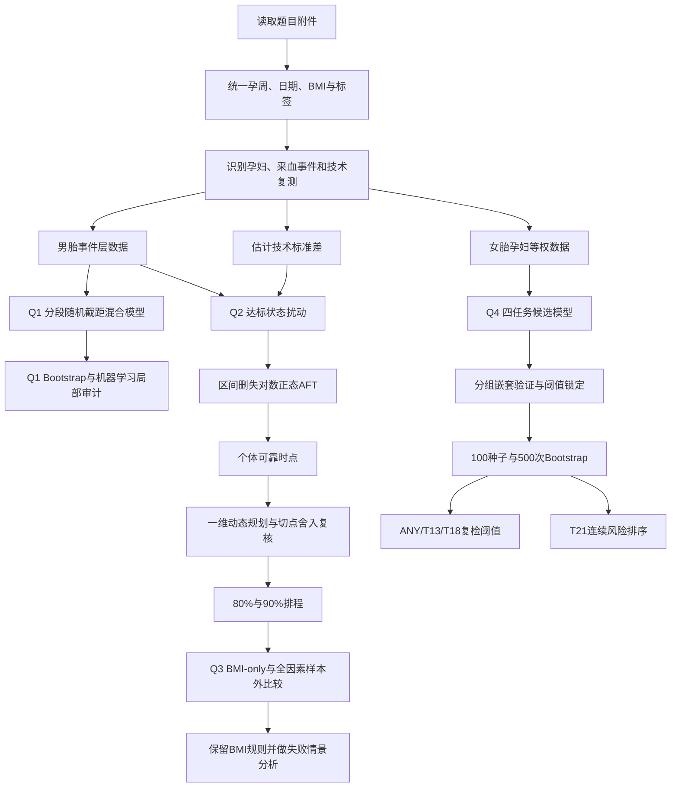
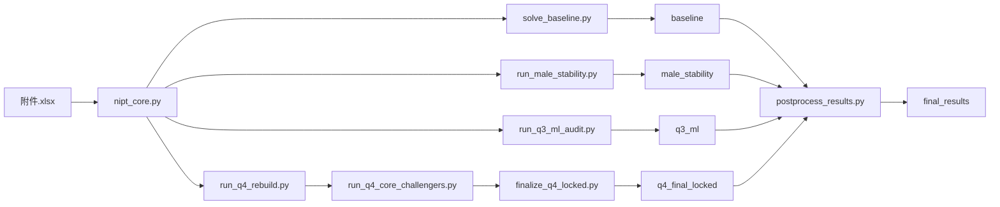

# 2025 高教社杯 C 题：NIPT 题目分析、建模思路与计算全流程

## 文档定位

本文档汇总本项目从题意拆解、数据层级整理、统计建模、机器学习对照、稳健性验证到最终决策输出的完整路线。它既可作为论文撰写前的技术底稿，也可作为仓库复现指南。文中的数值均对应仓库内已固化结果；候选模型与最终模型分开列示，避免把探索性结果误当成正式结论。

本题的核心并非分别求解四个互不相关的小问，而是建立一条连续的误差传递链：复测差异决定达标区间的可信程度，达标区间决定个体保守时点，动态规划把个体时点压缩为 BMI 分组规则，样本外比较再判断新增因素是否足以修正该规则。女胎分支沿用孕妇等权、组间隔离和阈值锁定原则，最终形成检测时点与复检规则两类决策。

---

## 1. 题目分析与整题建模主线

### 1.1 任务对象

NIPT 通过母体外周血中的胎儿游离 DNA 信息筛查染色体异常。题目给出的男胎数据含 Y 染色体浓度，可直接围绕“Y 浓度是否达到 4%”研究检测时点；女胎没有 Y 染色体这一判据，需要结合 13、18、21 号染色体的 Z 值、X 染色体信息、GC 含量、测序质量与孕妇特征识别异常。

四问可归纳为两条相互协调的分析线：

- 男胎主线：浓度关系解释 → 首次达标时间估计 → BMI 分组排程 → 新增因素是否值得修正规则。
- 女胎分支：异常标签拆分 → 稀疏多任务筛查 → 复检阈值与风险排序。

统计模型承担主线推断与外推。机器学习用于检验非线性结构是否带来稳定的样本外增益。当增益有限时，保留统计模型；当局部交互确有改进时，将机器学习模型作为相应子任务的补充。

### 1.2 跨问题联动链


箭头表示真实的数据或参数传递。问题一估计的技术误差和层级相关性用于问题二；问题二生成的个体时点用于动态规划；问题三以问题二规则为基线审查新增变量；问题四沿用孕妇等权和严格样本外评估原则，但不把男胎的 Y 浓度阈值强行移植到女胎。

### 1.3 全文统一建模口径

| 维度 | 统一口径 | 原因 |
|---|---|---|
| 独立个体 | 孕妇 | 同一孕妇可有多次采血和技术复测，记录之间并非独立 |
| 浓度分析单位 | 采血事件 | 同次采血复测先聚合，避免把技术重复误当成生物学重复 |
| 验证划分 | 按孕妇分组 | 防止同一孕妇记录同时出现在训练集与验证集 |
| 分类权重 | 每名孕妇总权重为 1 | 避免复测次数较多的孕妇支配损失函数 |
| 阈值选择 | 训练折内确定，验证折外评估 | 防止利用测试标签调阈值 |
| 不确定性 | 孕妇簇 Bootstrap | 保留同一孕妇内部的纵向相关结构 |
| 模型比较 | 样本外指标成对比较 | 以泛化能力决定是否增加复杂度 |
| 决策边界 | 10～25 周为主要检测窗口 | 与题目给出的检测时间要求一致 |
| 最终用途 | 筛查与复检排序 | 分类模型不替代临床确诊 |

---

## 2. 数据结构、清洗与基础变量

### 2.1 数据层级

数据天然形成“孕妇—采血事件—技术复测”三级结构。男胎部分共有 1082 条记录、267 名孕妇和 1022 个采血事件；女胎部分共有 605 条记录、147 名孕妇。若直接把每条记录当成独立样本，标准误会被低估，分类验证也会产生信息泄露。

设孕妇为 (i)，采血事件为 (v)，同次技术复测为 (r)。原始浓度写作 (Y_{ivr})。事件层聚合量为

\[
\bar Y_{iv}=\frac{1}{m_{iv}}\sum_{r=1}^{m_{iv}}Y_{ivr},
\]

其中 (m_{iv}) 是该次采血的复测数。孕周统一换算为十进制周：

\[
G_{iv}=w_{iv}+\frac{d_{iv}}{7},
\]

其中 (w_{iv}) 和 (d_{iv}) 分别表示整周和余天。

### 2.2 技术测量误差

同次采血的复测差异主要反映技术误差。对拥有复测的事件，使用组内残差平方和估计合并标准差：

\[
\hat\sigma_{\mathrm{tech}}
=\sqrt{
\frac{\sum_g\sum_{r=1}^{m_g}(Y_{gr}-\bar Y_g)^2}
{\sum_g(m_g-1)}}.
\]

估计得到

\[
\hat\sigma_{\mathrm{tech}}=0.00613,
\]

孕妇簇 Bootstrap 的 95% 区间为 ([0.00505,0.00749])。该误差随后用于扰动达标状态，而不是停留在描述统计中。

### 2.3 BMI 的层间与层内分解

同一孕妇在不同孕周的 BMI 可能变化。为区分个体长期差异和短期变化，令

\[
BMI_{iv}=BMI_{i0}+\Delta BMI_{iv},
\]

其中 (BMI_{i0}) 为该孕妇基线 BMI，

\[
\Delta BMI_{iv}=BMI_{iv}-BMI_{i0}.
\]

这样可以分别回答“基线 BMI 较高的孕妇是否整体达标更晚”以及“同一孕妇短期 BMI 变化是否改变浓度”两个问题。

### 2.4 缺失与异常处理原则

- 日期、孕周和数值字段先统一格式，再进行逻辑核对。
- 浓度必须落在概率变量的有效区间内；对数几率变换前采用极小截断避免无穷值。
- 同一采血事件的技术复测先聚合，原始记录保留用于技术标准差估计。
- 分类特征的缺失值填补、标准化和特征构造均在训练折内完成。
- 异常标签按孕妇编号与记录日期核对，保留总体异常和 T13、T18、T21 四个任务。

---

## 3. 问题一：Y 染色体浓度与孕周、BMI 的关系

### 3.1 问题概述

问题一需要描述 Y 染色体浓度随孕周和 BMI 的变化，并检验关系是否稳定。难点在于浓度有界、同一孕妇反复测量、18 周附近趋势可能改变，且 BMI 同时包含个体间差异与孕期内变化。

### 3.2 总体求解思路

先对事件层 Y 浓度作对数几率变换：

\[
Z_{iv}=\operatorname{logit}(\bar Y_{iv})
=\log\frac{\bar Y_{iv}}{1-\bar Y_{iv}}.
\]

随后建立 18 周分段线性随机截距混合模型：

\[
Z_{iv}=\beta_0
+\beta_1(G_{iv}-\bar G)
+\beta_2(BMI_{i0}-\overline{BMI})
+\beta_3\Delta BMI_{iv}
+\beta_4(G_{iv}-18)_+
+u_i+\varepsilon_{iv},
\]

其中 ((x)_+=\max(x,0))，(u_i\sim N(0,\sigma_u^2))，(\varepsilon_{iv}\sim N(0,\sigma_e^2))。18 周前斜率为 (\beta_1)，18 周后总斜率为 (\beta_1+\beta_4)。随机截距吸收孕妇之间稳定但未观测的差异。

组内相关系数为

\[
ICC=\frac{\sigma_u^2}{\sigma_u^2+\sigma_e^2}=0.7304,
\]

说明约 73.0% 的变异来自孕妇间稳定差异，使用普通独立回归会忽略主要相关结构。

### 3.3 候选模型比较

| 候选模型 | 优点 | 局限 | 本题结论 |
|---|---|---|---|
| 普通线性回归 | 解释直接 | 忽略有界响应与重复测量 | 不作为主模型 |
| 广义加性模型 | 能发现平滑非线性 | 外推和参数解释较弱 | 用于折点形态审查 |
| 分段随机截距混合模型 | 同时处理有界变换、折点和孕妇内相关 | 需要预设可解释折点 | 作为主模型 |
| 随机森林 | 捕捉局部非线性和交互 | 难以给出稳定的总体效应与外推 | 作为预测审计 |

随机森林相对 Ridge 的重复分组交叉验证 RMSE 平均改善 4.76%，说明局部非线性存在，但增益不足以替代混合模型承担效应解释和区间外推。因而统计模型保留为主线，随机森林仅检查局部预测偏差。

### 3.4 关键结果

| 参数 | 估计值 | 含义 |
|---|---:|---|
| 18 周前孕周斜率 (\beta_1) | 0.02338 | 早期 Y 浓度的对数几率随孕周上升 |
| 18 周后总斜率 (\beta_1+\beta_4) | 0.06315 | 18 周后上升速度增加 |
| 基线 BMI 系数 (\beta_2) | -0.03798 | 基线 BMI 越高，Y 浓度整体越低 |
| 孕期内 BMI 变化 (\beta_3) | 区间跨 0 | 短期变化未形成稳定独立效应 |

18 周折点相对无折点模型的似然比统计量为 19.1097，(p=1.23\times10^{-5})。500 次 Bootstrap 中，18 周前孕周效应、18 周后总斜率和基线 BMI 效应方向稳定；孕期内 BMI 变化区间跨越 0。这一结果直接支持问题二继续以首次 BMI 作为分组变量。

### 3.5 本问的特色与改进

| 设计 | 对后续问题的贡献 |
|---|---|
| 采血事件层聚合技术复测 | 给出独立于生物差异的技术误差估计 |
| BMI 层间—层内分解 | 解释为什么排程采用基线 BMI，而非每次波动值 |
| 18 周铰链项 | 允许浓度增长速度发生可解释改变 |
| 混合模型与机器学习并行审查 | 兼顾推断、外推与局部非线性检查 |

备选方案是在折点不稳定时改用限制性立方样条混合模型，并通过组间交叉验证选择自由度。当前折点在似然比检验和 Bootstrap 中均有支持，因此无需增加样条复杂度。

---

## 4. 问题二：首次达标时间、BMI 分组与最佳检测时点

### 4.1 问题概述

题目要求按 BMI 分组并确定最佳检测时点。直接对每个孕周的“是否达到 4%”做分类会丢失首次达标的时间信息，也无法妥善处理“第一次观测时已达标”或“最后一次观测仍未达标”的样本。因此将问题改写为带删失的首次达标时间问题。

### 4.2 从浓度观测构造删失区间

设真实首次达标时间为

\[
T_i=\inf\{t:Y_i(t)\ge 0.04\}.
\]

根据同一孕妇相邻采血时点，可构造三类信息：

- 首次观测已经达标：(T_i\le R_i)，为左删失；
- 某次未达标、下次达标：(L_i<T_i\le R_i)，为区间删失；
- 最后一次仍未达标：(T_i>L_i)，为右删失。

点判定下共有 217 个左删失、43 个区间删失和 7 个右删失个体。进一步引入技术标准差，对每次观测进行测量扰动，并在孕妇簇 Bootstrap 中重建删失区间，使技术误差沿“浓度—达标状态—达标时间—推荐时点”逐级传播。

### 4.3 区间删失对数正态 AFT 模型

采用加速失效时间模型：

\[
\log T_i=\alpha+\gamma\frac{BMI_i-31.8474}{2.9861}+\sigma\epsilon_i,
\qquad \epsilon_i\sim N(0,1).
\]

点估计为

\[
\log T_i=2.04707+0.11701\frac{BMI_i-31.8474}{2.9861}+0.53399\epsilon_i.
\]

区间删失个体的似然贡献为

\[
P(L_i<T_i\le R_i)
=\Phi\!\left(\frac{\log R_i-\mu_i}{\sigma}\right)
-\Phi\!\left(\frac{\log L_i-\mu_i}{\sigma}\right),
\]

左删失与右删失分别使用分布函数和生存函数。BMI 每增加 1 个单位，达标时间的点估计倍率约为

\[
\exp\!\left(\frac{0.11701}{2.9861}\right)\approx1.0398.
\]

测量扰动 Bootstrap 的中位倍率为 1.0331，说明 BMI 增加会使达标时间整体后移。

### 4.4 从个体可靠时点到分组排程

对可靠度 (\rho\)，定义个体保守时点

\[
\tau_i(\rho)=F^{-1}_{T_i}(\rho).
\]

将孕妇按 BMI 排序后，用一维动态规划寻找 (K) 个连续分组。若第 (a) 至第 (b) 个个体归为同一组，组时点 (t_{a:b}) 取该组个体可靠时点的高分位值，并以不对称损失评价“过早检测”和“过晚检测”：

\[
C(a,b)=\min_t\sum_{i=a}^{b}
\left[\lambda_-\,(\tau_i-t)_++\lambda_+\,(t-\tau_i)_+\right],
\qquad \lambda_->\lambda_+.
\]

动态规划递推为

\[
D(k,j)=\min_{h<j}\{D(k-1,h)+C(h+1,j)\}.
\]

它保证同一 BMI 区间内的个体连续，并在给定组数下得到全局最优切分。综合损失下降、可解释性和组内样本量，取 (K=4)。数学最优切点先由动态规划产生，再按 0.5 BMI 舍入并重新验证，最终得到 31、33.5、36。

### 4.5 候选方案比较

| 方案 | 能否处理删失 | 分组是否全局最优 | 可执行性 | 结论 |
|---|---:|---:|---:|---|
| 直接按 BMI 等距分组 | 否 | 否 | 高 | 缺少风险依据 |
| K-means 聚类 | 部分 | 否，且不保证区间连续 | 中 | 不符合临床阈值规则 |
| Cox 模型 + 手工分组 | 是 | 否 | 中 | 比例风险假设不便解释时间倍率 |
| 区间删失 AFT + 一维动态规划 | 是 | 是 | 高 | 最终采用 |

若区间删失 AFT 的分布假设明显失配，可改用半参数区间删失模型，并继续把个体分位时点输入同一动态规划。当前对数正态模型在样本外似然和概率校准上表现稳定，保留为主方案。

### 4.6 最终答案

| 可靠度 | BMI 组 | 样本数 | 推荐时点 | 决策 |
|---:|---|---:|---|---|
| 0.80 | (BMI<31) | 123 | 12 周 + 6 天 | 统一排程 |
| 0.80 | (31\le BMI<33.5) | 82 | 14 周 | 统一排程 |
| 0.80 | (33.5\le BMI<36) | 42 | 15 周 + 4 天 | 统一排程 |
| 0.80 | (BMI\ge36) | 20 | 19 周 + 6 天 | 统一排程 |
| 0.90 | (BMI<31) | 123 | 16 周 + 2 天 | 统一排程 |
| 0.90 | (31\le BMI<33.5) | 82 | 17 周 + 6 天 | 统一排程 |
| 0.90 | (33.5\le BMI<36) | 42 | 20 周 + 2 天 | 统一排程 |
| 0.90 | (BMI\ge36) | 20 | 28 周 + 3 天 | 超出 25 周窗口，个体化复检 |

500 次测量扰动孕妇簇 Bootstrap 下，80% 可靠度的平均归组一致率为 0.8821，90% 可靠度为 0.8256。波动主要集中在三个切点附近；远离切点的孕妇归组稳定。可靠度提高时，前三组时点连续后移，最高 BMI 组则发生决策类型改变，从统一排程转为 25 周内无法统一保证。

### 4.7 本问的特色与改进

| 设计 | 作用 |
|---|---|
| 浓度阈值改写为首次达标时间 | 完整利用纵向采血信息 |
| 左、区间、右删失统一建模 | 避免删除尚未达标或已提前达标个体 |
| 技术误差进入 Bootstrap | 推荐时点包含测量不确定性 |
| 精确一维动态规划 | 切点在给定组数下全局最优 |
| 舍入后重新验证 | 将数学切点转化为可执行 BMI 规则 |

---

## 5. 问题三：新增因素是否需要修正 BMI 分组规则

### 5.1 问题概述

年龄、身高、体重、孕产史等变量可能影响达标时间，但变量增多并不等于排程更可靠。本问的关键是检验这些变量能否在样本外稳定改善预测，而不是在训练数据上提高拟合度。

### 5.2 嵌套模型与比较准则

以问题二的 BMI-only AFT 为基准：

\[
\log T_i=\alpha+\gamma BMI_i+\sigma\epsilon_i.
\]

全因素模型写为

\[
\log T_i=\alpha+\gamma BMI_i+\boldsymbol\eta^\top\mathbf x_i+\sigma\epsilon_i,
\]

其中 (\mathbf x_i) 包含年龄、身高、体重、孕产史及质量变量。所有比较均按孕妇分组进行，在相同验证折上计算负对数似然和 Brier 分数：

\[
NLL=-\frac{1}{n}\sum_i\log P(T_i\in I_i\mid\mathbf x_i),
\]

\[
BS(t)=\frac{1}{n}\sum_i\left\{\mathbb I(T_i\le t)-\hat F_i(t)\right\}^2.
\]

负对数似然和 Brier 分数越小越好。另以离散时间风险建模为辅助线，比较正则化逻辑回归与随机森林，检查非线性交互是否带来重复随机种子下的稳定增益。

### 5.3 候选模型比较

| 候选模型 | 目的 | 样本外结果 | 是否修改主线 |
|---|---|---|---|
| BMI-only 区间删失 AFT | 最简基线 | NLL 0.6909，Brier 0.1022 | 保留 |
| 全因素区间删失 AFT | 检验额外线性效应 | 两项指标均变差，NLL 增加约 0.0948 | 不修改 |
| 正则化离散时间模型 | 检查高维线性增益 | 增益不稳定 | 辅助 |
| 随机森林离散时间模型 | 检查非线性交互 | ROC-AUC、Brier 有改善，PR-AUC 增量区间跨 0 | 辅助审计 |

随机森林相对 BMI-only 的平均 ROC-AUC 提高约 0.0401，Brier 分数改善约 0.0210，但 PR-AUC 仅提高约 0.0099，且不确定区间跨 0。该结果说明复杂模型能捕捉部分局部结构，却没有形成足以改写分组规则的稳定证据。

### 5.4 决策与误差情景

问题二的 BMI 切点与推荐时点全部保留。若单次检测失败概率为 (p_f)，重测延迟为 (\Delta)，期望风险可写为

\[
R(t)=(1-p_f)L(t)+p_fL(t+\Delta),
\]

其中 (L(t)) 表示时点 (t) 的综合损失。取 (p_f=0.15)、(\Delta=2) 周时，四组推荐时点约后移 2～3 天，分组边界不变。排程对合理的检测失败情景具有稳定性。

### 5.5 本问的特色与改进

| 设计 | 作用 |
|---|---|
| 以问题二规则为嵌套基线 | 形成跨问题的直接检验链 |
| 成对样本外比较 | 排除训练拟合改善造成的假增益 |
| 统计主线与机器学习辅助线 | 在解释性与局部非线性之间保持平衡 |
| 失败概率—重测延迟情景 | 把模型误差转化为排程变化 |

如果后续获得更多孕妇和更密集的纵向采血记录，可重新训练非线性离散时间模型，并以预注册的样本外门槛决定是否修正 BMI 规则。当前数据下，简洁的 BMI 排程具有更好的外推稳定性。

---

## 6. 问题四：女胎染色体异常筛查与复检规则

### 6.1 问题概述

女胎数据的异常阳性样本稀少，且同一孕妇可能有多条记录。总体准确率会被大量阴性样本抬高，因此不能据此评价模型。需要同时控制数据层级、类别不平衡、阈值选择和模型复杂度。

AB 字段拆分为四个任务：

- ANY：任一目标染色体异常；
- T13：13 号染色体异常；
- T18：18 号染色体异常；
- T21：21 号染色体异常。

阳性规模分别为：ANY 67 条记录、44 名孕妇；T13 23 条、18 名；T18 46 条、30 名；T21 13 条、12 名。T21 的有效阳性个体最少，必须单独处理。

### 6.2 孕妇等权与无泄露验证

若孕妇 (i) 有 (m_i) 条记录，则每条记录权重定义为

\[
w_{ij}=\frac{1}{m_i},
\qquad \sum_{j=1}^{m_i}w_{ij}=1.
\]

由此每名孕妇对目标函数和评价指标贡献相同。所有随机划分以孕妇为组；预处理、特征选择、超参数搜索和阈值选择均在训练层完成。外层验证折仅用于一次性评价。另设置按日期前后分割的留出集，检查模型在时间外推下的表现。

概率阈值 (c) 根据训练折的加权 F1 选择：

\[
c^*=\arg\max_c
\frac{2P_w(c)R_w(c)}{P_w(c)+R_w(c)}.
\]

报告加权精确率、召回率、F1、PR-AUC 与 ROC-AUC，并使用 100 次孕妇分组随机种子和 500 次孕妇簇 Bootstrap 评估稳定性。

### 6.3 候选模型与取舍

| 模型 | 适用结构 | 本题角色 | 取舍 |
|---|---|---|---|
| 单一 Z 值阈值 | 临床规则基线 | 官方思路对照 | 结构过于简单 |
| 弹性网络逻辑回归 | 稀疏线性组合、共线特征 | ANY、T18 主模型 | 稳定且便于解释 |
| 极端随机树 | 局部非线性与特征交互 | T13 主模型 | 时间留出表现较好 |
| LightGBM/随机森林 | 更复杂树模型 | 候选对照 | 稳定增益不足，未晋级 |
| 收缩线性判别分析 | 极少数阳性下的协方差收缩 | T21 风险排序 | 不设置自动阳性判定 |

ANY 使用 29 个核心特征的弹性网络。T18 使用 64 个工程化特征的弹性网络。T13 使用 29 个核心特征的极端随机树，以捕捉染色体 Z 值与 GC 偏离之间的局部交互。T21 采用收缩线性判别分析输出连续分数，服务于复检排序。

### 6.4 锁定模型结果

| 任务 | 锁定模型 | 精确率 | 召回率 | F1 | PR-AUC | ROC-AUC | 阈值/用途 |
|---|---|---:|---:|---:|---:|---:|---|
| ANY | 弹性网络逻辑回归 | 0.3980 | 0.4847 | 0.4320 | 0.4558 | 0.7900 | 0.7470，触发总体复检 |
| T13 | 极端随机树 | 0.2341 | 0.4437 | 0.3016 | 0.2219 | 0.8289 | 0.2772，触发分型复检 |
| T18 | 弹性网络逻辑回归 | 0.4237 | 0.5249 | 0.4648 | 0.4771 | 0.8247 | 0.7448，触发分型复检 |
| T21 | 收缩线性判别分析 | 0.0426 | 0.3462 | 0.0581 | 0.1444 | 0.4653 | 连续分数排序，不作自动判定 |

按时间顺序留出时，T13 的加权 F1 为 0.5323。500 次 Bootstrap 的 F1 区间为：ANY ([0.3600,0.5983])、T13 ([0.2141,0.5853])、T18 ([0.3354,0.6423])、T21 ([0,0.3168])。T21 的区间下限为 0，自动判定缺乏稳定支持，因此仅保留连续风险分数。

### 6.5 为什么不追求“九十几的准确率”

女胎异常率较低。即使模型把大多数样本都判为阴性，准确率也可能很高，但阳性召回率接近 0。正式选择优先考察 PR-AUC、精确率、召回率和 F1，并按孕妇隔离验证。该口径得到的数值低于记录级随机切分，却更接近真实外推场景。

### 6.6 本问的特色与改进

| 设计 | 作用 |
|---|---|
| 总体异常与三个分型任务拆分 | 避免一个模型掩盖不同染色体的差异 |
| 每名孕妇等权 | 消除复测次数差异造成的权重偏移 |
| 分组嵌套验证与时间留出 | 同时检验个体外推和时间外推 |
| 按任务选择模型 | 在稳定性和局部非线性之间有针对性取舍 |
| T21 改为风险排序 | 与极少数阳性带来的统计不确定性相匹配 |

备选方案是在积累更多阳性病例后，采用多任务层级模型共享 T13、T18、T21 之间的信息，并在独立中心数据上重新校准阈值。当前数据量不足以支持更复杂的联合模型。

---

## 7. 推荐的全文技术路线



整条路线具有明确的输入输出关系：Q1 产生关系结构和技术误差依据；Q2 产生个体时点、切点和组时点；Q3决定是否改写 Q2；Q4产生女胎复检概率或风险分数。

---

## 8. 落地计算流程

### 8.1 环境与依赖

建议使用 Python 3.11 或更高版本。仓库依赖集中记录在 `requirements.txt`，主要包括 NumPy、Pandas、SciPy、Statsmodels、scikit-learn、LightGBM、Optuna、PyWavelets 与 openpyxl。

```bash
python -m venv .venv
source .venv/bin/activate
python -m pip install -r requirements.txt
```

### 8.2 核心程序职责

| 文件 | 核心职责 | 主要输出 |
|---|---|---|
| `nipt_solution/nipt_core.py` | 数据清洗、孕周解析、技术误差、删失区间、AFT 似然、分组折、孕妇权重、动态规划 | 各求解脚本共享的基础函数 |
| `nipt_solution/solve_baseline.py` | Q1 混合模型、Q2 AFT 与初始排程、Q3 嵌套 AFT、女胎数据审计 | `outputs/baseline/` |
| `nipt_solution/run_male_stability.py` | Q1 Bootstrap、Q2 测量扰动簇 Bootstrap、Q3 重复分组比较 | `outputs/male_stability/` |
| `nipt_solution/run_q3_ml_audit.py` | Q3 轻量机器学习辅助线与 100 随机种子审查 | `outputs/q3_ml/` |
| `nipt_solution/run_q4_rebuild.py` | Q4 候选特征、候选模型、嵌套验证与稳定性 | `outputs/q4_rebuild/` |
| `nipt_solution/run_q4_core_challengers.py` | Q4 核心特征挑战者和时间外推比较 | `outputs/q4_core_challengers/` |
| `nipt_solution/finalize_q4_locked.py` | 固定 Q4 最终任务模型、阈值与 Bootstrap 汇总 | `outputs/q4_final_locked/` |
| `nipt_solution/run_sensitivity_extras.py` | 误差口径、可靠度和复检情景敏感性 | 相应敏感性结果目录 |
| `nipt_solution/postprocess_results.py` | 汇总最终答案与证据表 | `outputs/final_results/` |

### 8.3 推荐运行顺序

所有命令从仓库根目录执行。

```bash
# 1. 四问基线结果
python nipt_solution/solve_baseline.py \
  --data 附件.xlsx \
  --output nipt_solution/outputs/baseline

# 2. Q1-Q3：500 次 Bootstrap 与重复分组验证
python nipt_solution/run_male_stability.py \
  --data 附件.xlsx \
  --output nipt_solution/outputs/male_stability \
  --bootstrap 500 \
  --q1-cv-seeds 20 \
  --q3-cv-seeds 100

# 3. Q3：机器学习辅助线审计
python nipt_solution/run_q3_ml_audit.py \
  --data 附件.xlsx \
  --output nipt_solution/outputs/q3_ml \
  --seeds 100

# 4. Q4：候选模型、嵌套验证与稳定性分析
python nipt_solution/run_q4_rebuild.py \
  --data 附件.xlsx \
  --output nipt_solution/outputs/q4_rebuild \
  --phase all \
  --stability-seeds 100 \
  --bootstrap 500

# 5. Q4：核心挑战者与最终锁定
python nipt_solution/run_q4_core_challengers.py
python nipt_solution/finalize_q4_locked.py

# 6. 复核早期综合索引（历史汇总流程）
python nipt_solution/postprocess_results.py
```

`postprocess_results.py` 保留了早期综合索引的生成过程，不会替代 `q4_final_locked/` 中的锁定结果。正式复核时，Q1～Q3 读取 `final_results/`，Q4 读取 `q4_final_locked/`。部分脚本提供更多命令行参数；若只核对论文数字，可直接读取已经固化的 CSV、JSON 和 NPZ，无需重复运行 500 次 Bootstrap。

### 8.4 计算依赖关系



### 8.5 关键结果文件映射

| 需要核对的结论 | 结果位置 |
|---|---|
| Q1 系数、ICC、折点检验 | `nipt_solution/outputs/final_results/solution_summary.json` |
| Q1 Bootstrap 区间与机器学习增益 | `nipt_solution/outputs/final_results/q1_*` |
| Q2 BMI 切点、推荐时点、可行性 | `nipt_solution/outputs/final_results/q2_final_policies.csv` |
| Q2 分组与时点稳定性 | `nipt_solution/outputs/male_stability/` 与 `final_results/q2_*` |
| Q3 嵌套模型比较 | `nipt_solution/outputs/final_results/q3_*` |
| Q4 最终模型选择 | `nipt_solution/outputs/q4_final_locked/q4_locked_model_selection.csv` |
| Q4 Bootstrap 区间 | `nipt_solution/outputs/q4_final_locked/q4_locked_bootstrap_summary.csv` |
| Q4 时间留出表现 | `nipt_solution/outputs/q4_final_locked/q4_locked_chronological.csv` |
| 全部最终答案索引 | `nipt_solution/outputs/final_results/RESULTS_README.md` |

### 8.6 防止数据泄露的实现检查

1. 训练集与验证集按孕妇编号划分，同一孕妇的所有记录保持在同一侧。
2. 标准化、缺失填补、特征筛选和超参数搜索均放在训练折内部。
3. 分类阈值由训练折预测选择，不查看外层验证标签。
4. 100 次随机种子比较使用相同的孕妇划分，使模型差值可成对比较。
5. Bootstrap 以孕妇为抽样单位，并带走该孕妇的全部记录。
6. 时间顺序留出以日期划分训练期和测试期，用于检查时间外推。
7. 最终模型和阈值锁定后，再生成一次汇总结果，候选搜索结果不冒充最终性能。

---

## 9. 多模型公平比较与稳健性设计

### 9.1 比较原则

所有候选模型共享同一分析单位、训练/验证折、样本权重和评价指标。比较的对象是同一验证样本上的指标差，而非各模型在不同划分下的最好成绩。模型复杂度只有在样本外增益稳定时才被接受。

### 9.2 稳健性矩阵

| 环节 | 不确定性来源 | 方法 | 传递到的结论 |
|---|---|---|---|
| 浓度测量 | 技术复测差异 | 合并技术标准差及 Bootstrap | 达标状态 |
| Q1 参数 | 孕妇抽样波动 | 500 次孕妇簇 Bootstrap | 孕周、BMI 效应方向 |
| Q2 达标时间 | 测量误差与删失 | 测量扰动簇 Bootstrap | 个体可靠时点 |
| Q2 分组 | 个体时点波动 | 每次重跑动态规划 | 切点与归组概率 |
| Q2 排程 | 可靠度选择 | (\rho=0.80,0.90) 对照 | 组时点与 25 周可行性 |
| Q3 模型 | 随机划分与特征增量 | 成对分组交叉验证、100 种子 | 是否修改 BMI 规则 |
| Q4 模型 | 稀疏阳性与时间漂移 | 嵌套验证、100 种子、500 次 Bootstrap、时间留出 | 锁定模型与复检阈值 |

### 9.3 机器学习是否真正提升主线

| 问题 | 机器学习结果 | 处理方式 |
|---|---|---|
| Q1 | 随机森林 RMSE 比 Ridge 改善 4.76% | 保留为局部预测审计，不替代混合模型 |
| Q2 | 核心任务是删失时间与可执行分组 | 不增加黑箱模型，使用 AFT + 动态规划 |
| Q3 | 部分排序与校准指标改善，PR-AUC 增益不稳定 | 不修改 BMI 主规则 |
| Q4 | T13 的极端随机树在时间留出中有明显改善 | 对 T13 强调机器学习辅助；ANY/T18 保留弹性网络 |
| Q4-T21 | 复杂模型受极少数阳性限制 | 改为收缩 LDA 连续风险排序 |

---

## 10. 最终答案汇总

### 10.1 男胎检测时点

- 18 周前孕周效应为 0.02338，18 周后总斜率为 0.06315。
- 基线 BMI 效应为 -0.03798，孕期内 BMI 变化没有稳定独立效应。
- 80% 可靠度下，BMI 切点为 31、33.5、36，四组推荐时点为 12 周 + 6 天、14 周、15 周 + 4 天、19 周 + 6 天。
- 90% 可靠度下，前三组为 16 周 + 2 天、17 周 + 6 天、20 周 + 2 天；最高 BMI 组的统一保守时点为 28 周 + 3 天，超出 25 周窗口，应转为个体化复检。
- 年龄、身高、孕产史等新增因素未在样本外稳定改善 AFT 模型，因此不修改上述分组。

### 10.2 女胎复检规则

- 总体异常 ANY：弹性网络，复检触发阈值 0.7470。
- T13：极端随机树，复检触发阈值 0.2772。
- T18：弹性网络，复检触发阈值 0.7448。
- T21：收缩线性判别分析输出连续风险分数，按分数安排复检优先级，不给出自动阳性阈值。

这些输出均为筛查和复检决策，不构成染色体异常的临床确诊。

---

## 11. 论文落地清单

### 11.1 正文必须呈现

- 数据三级结构与事件层聚合方式。
- 技术标准差的估计公式和数值。
- Q1 的对数几率变换、18 周铰链混合模型、ICC 与 Bootstrap 区间。
- Q2 的删失区间构造、AFT 似然、个体可靠时点、动态规划递推和两档排程。
- Q3 的嵌套样本外比较与检测失败情景。
- Q4 的孕妇等权、分组嵌套验证、模型锁定结果和阈值用途。
- 500 次 Bootstrap、100 随机种子与时间留出的稳健性结论。

### 11.2 适合放入附录

- 数据字段与缺失率表。
- 各模型全部参数与完整候选排名。
- Q1 四个系数的 500 次 Bootstrap 明细。
- Q2 每次 Bootstrap 的切点、归组和组时点明细。
- Q3 每个随机种子的成对指标差。
- Q4 500 次 Bootstrap 的完整指标分布与时间留出混淆矩阵。
- 脱敏后的核心求解程序。

### 11.3 图表建议

- Q1：孕周—BMI—Y 浓度三维响应面，配合边际密度或个体轨迹。
- Q2：删失区间、BMI 切点、组时点和可靠度边界的联动图。
- Q3：BMI-only 与全因素模型的成对样本外差值分布。
- 稳健性：参数 → 切点 → 归组 → 排程的 Bootstrap 决策稳定性四联图。
- Q4：任务交集、概率分布、PR 曲线、阈值混淆结构和时间留出对照。

---

## 12. 完整性与断链检查

| 检查项 | 状态 | 说明 |
|---|---|---|
| Q1 是否为 Q2 提供输入 | 完整 | 提供 BMI 主效应、技术误差和层级相关性 |
| Q2 是否回答分组与时点 | 完整 | 给出两档可靠度、三个切点、四组时点和不可行情形 |
| Q3 是否检验而非重复 Q2 | 完整 | 用样本外比较判断新增因素是否修正规则 |
| Q4 是否避免记录级泄露 | 完整 | 孕妇分组、孕妇等权、训练内阈值 |
| 机器学习是否形成方法堆砌 | 已控制 | 仅 T13 的稳定非线性增益进入最终模型 |
| 测量误差是否传递到决策 | 完整 | 技术标准差进入达标状态、删失区间、时点与分组 Bootstrap |
| 外推能力是否检查 | 完整 | 分组交叉验证、时间顺序留出和可靠度情景 |
| 最终答案是否可执行 | 完整 | 输出 BMI 规则、周+天时点、复检阈值与 T21 排序策略 |

---

## 13. 复现注意事项与可扩展方向

1. 原始附件更新后，应从基线清洗开始全流程重算，不宜直接沿用旧阈值。
2. 若同次采血复测的定义发生改变，应首先重新估计技术标准差，再重跑 Q2 Bootstrap。
3. 若新数据包含更多高 BMI 孕妇，需重点检查最高 BMI 组的 25 周可行性。
4. 若女胎阳性病例显著增加，可重新比较 LightGBM、多任务模型和概率校准方法。
5. 外部数据验证时应固定当前特征、模型和阈值，先评价后再校准，避免用外部测试集重新选模。
6. 所有输出目录都应保留运行参数、随机种子和数据摘要，以便区分探索结果与最终锁定结果。

本文档对应当前仓库的最终建模口径。若论文文字、图表或附录出现与固化结果不一致的数字，应以 `outputs/q4_final_locked/` 和 `outputs/final_results/` 中的正式结果表为准，并追溯相应计算脚本。
