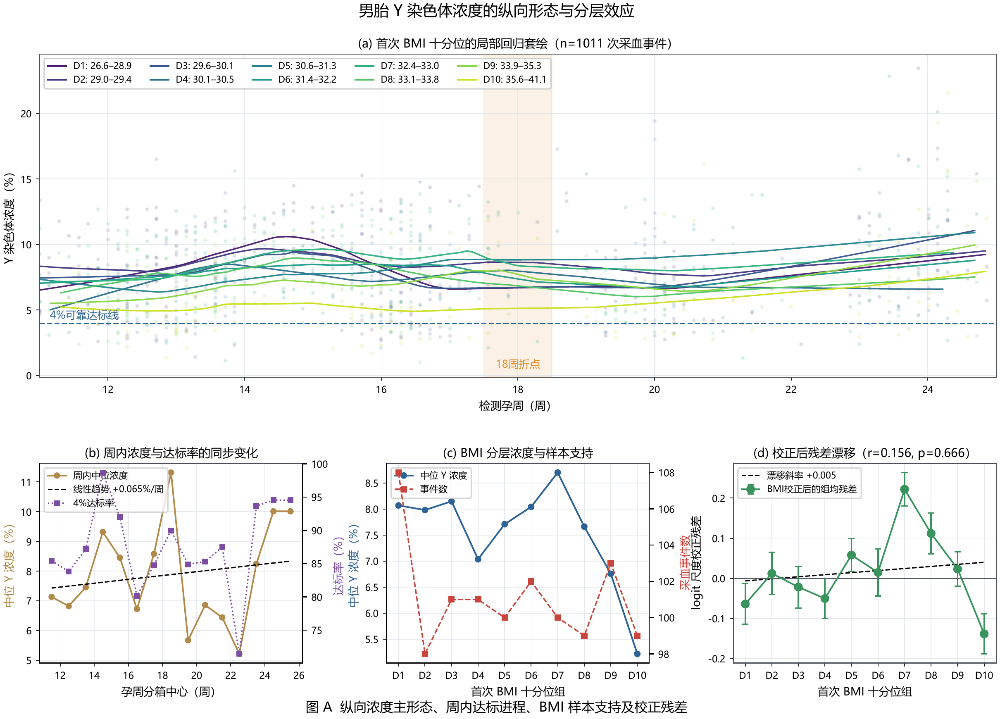
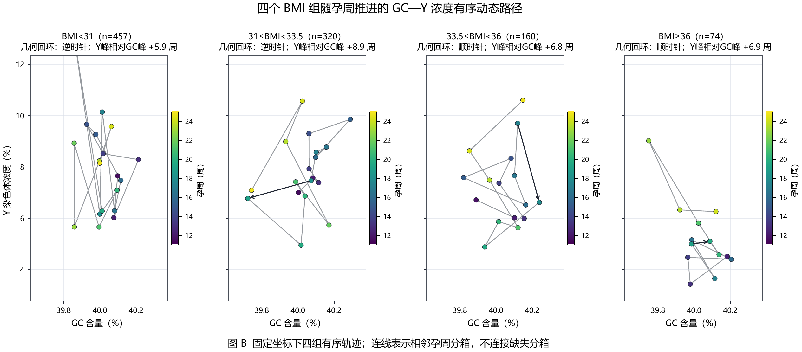
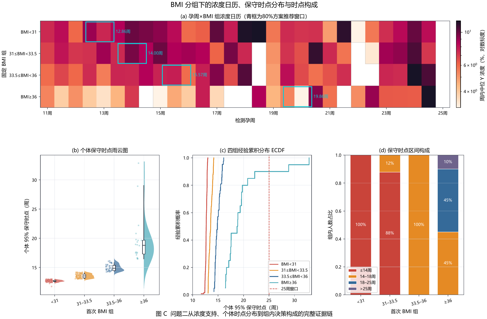
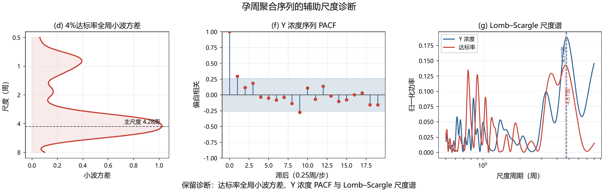
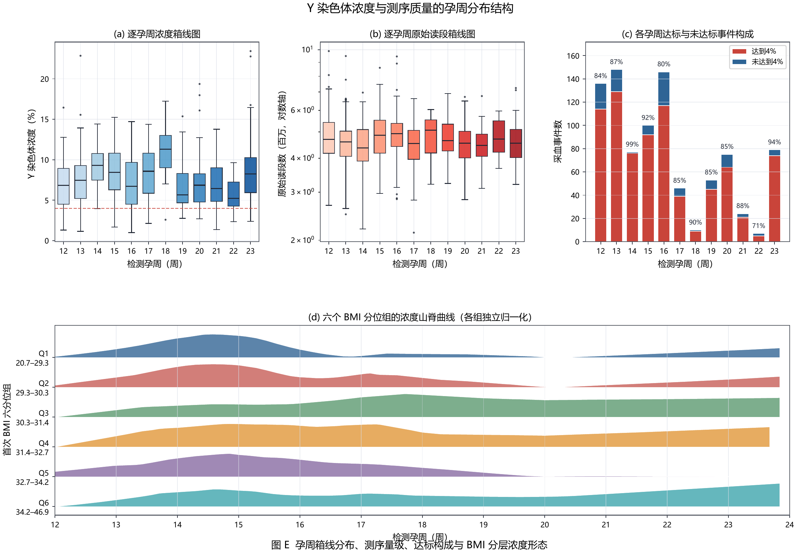
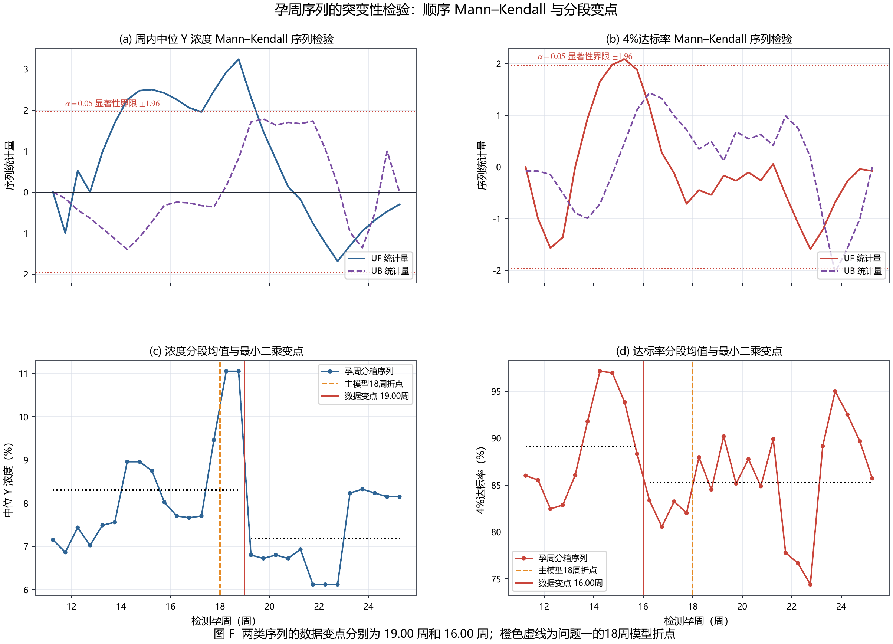

# NIPT 真实数据参考组图（独立文件）

本目录将原六页组图拆分为独立的单页矢量 PDF 与高清 PNG，便于在 GitHub 中直接预览和单独引用。PDF 保留矢量文字与线条，PNG 用于网页浏览。

## 图 A　男胎 Y 染色体浓度的纵向形态与分层效应

[矢量 PDF](fig_ref_a_longitudinal_bmi_effects.pdf)

## 图 B　四个 BMI 组随孕周推进的 GC—Y 浓度动态路径

[矢量 PDF](fig_ref_b_gc_y_dynamic_paths.pdf)

## 图 C　BMI 分组下的浓度日历、保守时点分布与时点构成

[矢量 PDF](fig_ref_c_bmi_calendar_schedule.pdf)

## 图 D　孕周聚合序列的辅助尺度诊断

[矢量 PDF](fig_ref_d_scale_diagnostics.pdf)

## 图 E　Y 染色体浓度与测序质量的孕周分布结构

[矢量 PDF](fig_ref_e_gestational_distribution.pdf)

## 图 F　顺序 Mann–Kendall 检验与分段变点

[矢量 PDF](fig_ref_f_mann_kendall_changepoints.pdf)

